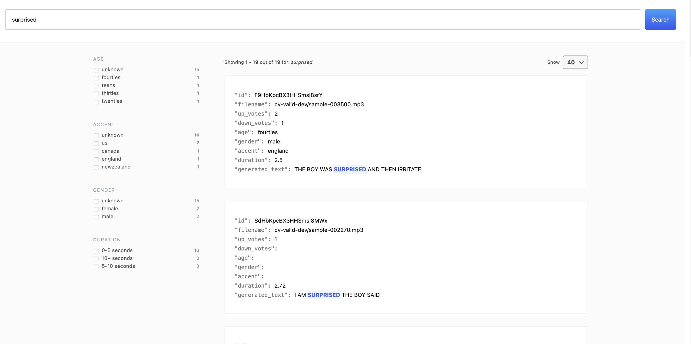

# Speech Recognition Test

## Overview

This repository contains a speech recognition system with three main components:

1. An Automatic Speech Recognition (ASR) microservice that transcribes audio files
2. An Elasticsearch backend for storing and querying generated transcriptions
3. A Search UI frontend that allows searching through transcribed audio

The following instructions provide the steps required to run the components and services locally. The final solution is deployed on the public cloud (AWS) for review.

## A. Developer Setup and Installation

#### 1. Create and activate a virtual environment:

```
python -m venv .venv
source .venv/bin/activate  # On Unix/macOS
# or
.venv\Scripts\activate  # On Windows
```

#### 2. Install dependencies using pip:

```
pip install -r requirements.txt
```

#### 3. Install pre-commit hooks:

```
pre-commit install
```

#### 4. Install ffmpeg

```
brew install ffmpeg # On macOS
# or
sudo apt update # On Linux
sudo apt install ffmpeg
# or
choco install ffmpeg # On Windows

```

## B. Running Automatic Speech Recognition microservice locally

#### 1. Create an `.env` file and input the name of the HuggingFace model to use for audio transcription

```
cp .env.example .env
```

```
HF_MODEL_NAME=
```

#### 2. Build and run the image

```
docker build -t asr-api -f asr/Dockerfile .

docker run --rm -p 8001:8001 --name asr-api asr-api
```

#### 3. Test the endpoint using CURL

```
curl -F "files=@/path/to/audio-file/MKH800_19_0001.wav" http://localhost:8001/asr
```

```json
[
  {
    "transcription": "SHE HAD YOUR DARK SUIT IN GREASY WASH WATER ALL YEAR",
    "duration": "3.62"
  }
]
```

#### 4. Place all audio files in a folder named `cv-valid-dev`

#### 5. In the `.env` file, update a suitable `BATCH_SIZE` value (defaults to 20)

```
BATCH_SIZE=
```

#### 6. Run `asr/cv-decode.py` at the root level, specifying the path of the audio files (`cv-valid-dev`) and the csv file to save the generated texts to

```
python asr/cv-decode.py cv-valid-dev <save_csv_file_name>
```

## C. Setting up the elastic search backend locally

#### 1. In the .env file, update the following variables

```
ELASTIC_PASSWORD=
CLUSTER_NAME=asr-es-cluster
INDEX_NAME=cv-transcriptions
ES_PORT=9200
```

#### 2. Start the services

```
docker compose -f elastic-backend/docker-compose.yml --env-file .env up
```

#### 3. After the services are up, create an index called `cv-transcriptions` by running the `elastic-backend/create-index.sh` script

```
bash elastic-backend/create-index.sh
```

#### 4. Verify that the index has been created succcesfully:

```
curl -X GET "http://localhost:9200/_cat/indices" -u "elastic:$ELASTIC_PASSWORD"

# green open cv-transcriptions 7j7yI0oMSC2aSaRsmgQq5w 2 1 0 0 908b 454b 454b

```

```
curl -X GET "http://localhost:9200/cv-transcriptions/\_count?pretty" -u "elastic:$ELASTIC_PASSWORD"

```

```json
{
  "count": 0,
  "_shards": {
    "total": 2,
    "successful": 2,
    "skipped": 0,
    "failed": 0
  }
}
```

#### 5. After the index is created, run `elastic-backend/cv-index.py` at the root level, specifying the path of the csv file containing the generated texts

```
python elastic-backend/cv-index.py <records_path>
```

#### 6. Verify that the records have been succesfully indexed

```
curl -X GET "http://localhost:9200/cv-transcriptions/_search?size=2&pretty" -u "elastic:$ELASTIC_PASSWORD"
```

```json
{
  "took": 11,
  "timed_out": false,
  "_shards": {
    "total": 2,
    "successful": 2,
    "skipped": 0,
    "failed": 0
  },
  "hits": {
    "total": {
      "value": 4076,
      "relation": "eq"
    },
    "max_score": 1.0,
    "hits": [
      {
        "_index": "cv-transcriptions",
        "_id": "tMuXKZcB4uKBUf0WHfFH",
        "_score": 1.0,
        "_source": {
          "filename": "cv-valid-dev/sample-000000.mp3",
          "text": "be careful with your prognostications said the stranger",
          "up_votes": 1,
          "down_votes": 0,
          "age": null,
          "gender": null,
          "accent": null,
          "duration": 4.36,
          "generated_text": "BE CAREFUL WITH YOUR PROGNOSTICATIONS SAID THE STRANGER"
        }
      },
      {
        "_index": "cv-transcriptions",
        "_id": "tcuXKZcB4uKBUf0WHfFI",
        "_score": 1.0,
        "_source": {
          "filename": "cv-valid-dev/sample-000001.mp3",
          "text": "then why should they be surprised when they see one",
          "up_votes": 2,
          "down_votes": 0,
          "age": null,
          "gender": null,
          "accent": null,
          "duration": 2.38,
          "generated_text": "THEN WHY SHOULD THEY BE SURPRISED WHEN THEY SEE ONE"
        }
      }
    ]
  }
}
```

## D. Setting up the Search UI frontend locally

#### 1. Start the service

```
docker-compose -f search-ui/docker-compose.yml --env-file .env up
```

#### 2. Once the service is up, open `localhost:3000` on your browser and test the filters/fuzzy search to verify that the Search UI service is working as intended for the relevant fields



## E. Cloud Deployment

The solution is deployed to the public cloud on AWS. It comprises of the backend elastic search and frontend search UI service, allowing users to search audio files based on the generated texts, duration, age, gender and accent.

To access it, please refer to the deployment URL as attached in the submission email.

## F. Potential improvements:

#### ASR microservice:

- An orchestrator to trigger scheduled batch transcriptions
- S3 integration for audio files and generated texts
- Dynamic batching of audio files based on length
- Queue-based architecture with retry mechanisms and dead letter queues for failed processing
- Container-based deployment with GPU support and autoscaling via ECS

#### Elastic search backend and frontend deployment:

- A proxy server can be set up so that requests are forwarded to the backend, instead of directly from browser to the backend
- The backend and frontend instances are currently public facing. To address this, the backend and frontend instances can be in a private subnet, with EC2 instance connect enabling admin access.
